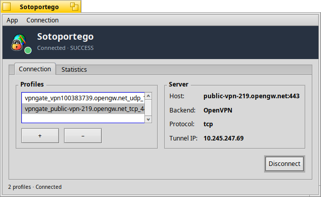
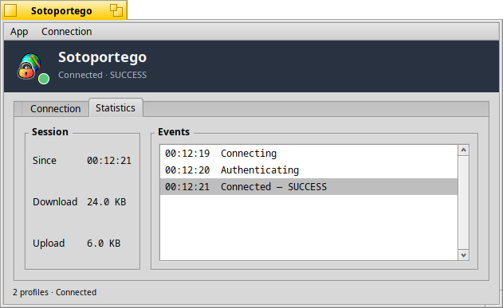

# Sotoportego

Native VPN client for Haiku: a privilege-separated background daemon that
owns the VPN lifecycle, with a Haiku-native GUI front-end and a CLI test
client driving it over `BMessage`. OpenVPN is wired in end to end —
`.ovpn` import, real management-interface session, `tun/0` device set-up,
routing fix-up, live throughput and event log.

<p align="center">
  <br/>
  <em>Connection tab — profiles on the left, server details and Tunnel IP on the right.</em>
</p>

<p align="center">
  <br/>
  <em>Statistics tab — session totals and a timestamped event log.</em>
</p>

If Sotoportego saves you time, consider supporting development: [](https://buymeacoffee.com/atomozero)


## Features

* **End-to-end OpenVPN** — spawns the `openvpn` binary with
  `--management 127.0.0.1 <port> --management-hold`, talks to its
  management socket from a dedicated reader thread, and posts every
  parsed event back to the daemon's looper.
* **Haiku-specific glue** — brings `tun/0` up before openvpn starts (the
  Haiku port can't allocate the tun device dynamically) and installs the
  pushed default route via the in-tunnel peer on `tun/0` so traffic
  actually flows through the tunnel.
* **Profile management** — import any `.ovpn` file through a file panel.
  The daemon persists the list at
  `~/config/settings/Sotoportego/profiles` and broadcasts changes to
  every subscribed client.
* **Privilege-separated design** — a background daemon
  (`B_BACKGROUND_APP`, hidden from Deskbar) owns the VPN lifecycle; the
  GUI and CLI are user-facing clients that talk to it over `BMessage`.
* **Native Haiku IPC** — `BApplication` / `BLooper` / `BHandler` all the
  way down; no sockets, no JSON, no daemons-of-daemons.
* **Pluggable backend interface** (`VPNBackend`) — OpenVPN ships today;
  WireGuard and IPSec slot into the same seam later.
* **Asynchronous status broadcasts** — `kMsgStatusUpdate` /
  `kMsgStatsUpdate` carry state, detail, both ends of the tunnel and a
  throughput snapshot to every subscribed client.
* **Mose-inspired GUI** — slate header banner with the HVIF brand tile
  and a state-coloured status dot, tabbed `Connection` / `Statistics`
  layout, About dialog with the same brand identity.
* **Credentials prompt** — modal `CredentialsWindow` before every
  Connect; the user-supplied user/password ride a transient field on the
  Connect message and never get persisted.
* **Desktop notifications** — `BNotification` toasts on Connect /
  Disconnect / Error so the GUI doesn't have to be in the foreground.
  The Connect notification then updates itself with the *apparent
  country* once a background geo-lookup (HTTP through the tunnel)
  returns.
* **CLI test client** — `sotoportego_cli` proves the IPC + backend seams
  with a one-shot connect / linger / disconnect round-trip.
* **Built-in event log** — every state transition is appended to the
  Statistics tab with a timestamp, so failures are never silent.


## Requirements

* **Haiku R1/beta5 or newer** with the standard `makefile-engine` at
  `/system/develop/etc/makefile-engine`.
* **OpenVPN** from HaikuDepot — install once:

  ```
  pkgman install openvpn
  ```

* The kernel **tunnel** network add-on, shipped with Haiku at
  `/system/add-ons/kernel/network/devices/tunnel`. The daemon publishes
  the actual device with `ifconfig tun/0 up` on every Connect, so no
  manual setup is required.


## Build

The project builds and runs on Haiku only. Each binary has its own
makefile under `src/`; the top-level `Makefile` recurses into them.

```
make                       # builds everything: daemon + CLI + GUI
make -C src/server         # builds just the daemon
make -C src/cli            # builds just the CLI client
make -C src/gui            # builds just the GUI client
make clean                 # removes all build artifacts
```

The produced binaries land in each subdirectory's
`objects.x86_64-cc13-release/` folder.


## Run

### GUI

```
./src/gui/objects.x86_64-cc13-release/Sotoportego
```

The GUI launches the daemon automatically via `be_roster`. From there:

1. Click **+** to import an `.ovpn` profile. The daemon parses
   `remote`, `proto`, `port` and `auth-user-pass` and stores the
   profile; the file path stays where you picked it from.
2. Select a profile in the list. The **Server** box on the right shows
   the host, backend, protocol and (after Connect) the tunnel-assigned
   **Tunnel IP**.
3. Click **Connect**, fill in the credentials prompt, watch the status
   dot in the header walk through *Connecting → Authenticating →
   Connected*. The **Statistics** tab keeps a live event log and
   download/upload counters.
4. **Disconnect** asks openvpn to terminate via the management socket,
   removes the routes we installed and deletes `tun/0` from the
   interface list, so the routing table is left exactly the way it was
   found.

### Daemon (manual)

You can start the daemon by hand to watch its log — useful while
diagnosing a `.ovpn` that misbehaves:

```
./src/server/objects.x86_64-cc13-release/sotoportego_server
```

Every line that openvpn writes over its management socket is echoed as
`[OpenVPN] <message>`, so any `AUTH_FAILED`, `route` error or `FATAL`
shows up immediately next to the daemon's own state-machine events.

### CLI

```
./src/cli/objects.x86_64-cc13-release/sotoportego_cli
```

`sotoportego_cli` launches the daemon if needed, subscribes for
updates, connects with a small built-in demo profile, prints every
state and stats update, then disconnects and exits. It's the simplest
proof that the IPC and backend seams work end to end without the GUI.


## Layout

```
src/common/    Shared types and wire protocol (VPNState, VPNStats,
               VPNProfile, VPNProtocol.h, OpenVPNConfigParser)
src/backend/   Backend seam: VPNBackend interface, real OpenVPNBackend
               (process + management socket + reader thread), and
               OpenVPNManagement (the management-interface parser)
src/server/    The daemon (a BApplication / BLooper), ProfileStore
               (persistent profiles), and GeoLookup (background HTTP
               worker behind the connect notifications)
src/cli/       sotoportego_cli — the test client
src/gui/       Sotoportego — the native GUI client (HeaderView,
               MainWindow, CredentialsWindow, About, brand HVIF)
```

| Binary               | MIME signature                              |
| -------------------- | ------------------------------------------- |
| `sotoportego_server` | `application/x-vnd.VePro-SotoportegoServer` |
| `sotoportego_cli`    | `application/x-vnd.VePro-SotoportegoCLI`    |
| `Sotoportego`        | `application/x-vnd.VePro-Sotoportego`       |


## Architecture notes

* **The daemon is the single source of truth.** Clients can come and go
  (the GUI can be closed without dropping the session); the daemon keeps
  the openvpn child alive, the management socket open and the in-memory
  state authoritative. Reconnecting clients get the current snapshot
  plus the profile list as part of `kMsgSubscribe`.
* **All state mutations happen on the looper thread.** The reader thread
  reads bytes off the management socket, hands them to
  `OpenVPNManagement::Feed()`, and posts each parsed event back via
  `BMessenger(this)` so the backend's `MessageReceived` is the only
  place state changes — no locks, no surprises.
* **Routing fix-up is ours.** The Haiku patches to openvpn 2.6.13
  hardcode the underlying physical interface in every route command, so
  the pushed `redirect-gateway def1` ends up on wifi/ethernet instead of
  the tunnel. We pass `--route-noexec`, scan `ROUTE_GATEWAY` and
  `PUSH_REPLY` out of the log stream, and install three routes
  ourselves (the VPN server pinned to the original gateway, plus two
  `/1` halves of the default via the tunnel peer on `tun/0`). Both the
  routes and the `tun/0` interface itself are torn back down on
  Disconnect.
* **Notifications go through the tunnel.** The geo-lookup behind the
  Connect notification fires *after* CONNECTED, so the HTTP request to
  ip-api.com travels through `tun/0` and reports the country we now
  appear to come from, not the carrier's. It's a 4-second worker
  thread with a hard timeout; if the egress blocks port 80 the
  original "Connected to ..." toast stays put.
* **`docs/` and `tests/` are intentionally not part of the repo.** They
  live on disk for the author's workflow but the tracked tree is the
  shipping artefact.


## Roadmap

* WireGuard backend behind the same `VPNBackend` interface.
* Credential storage via the Haiku keystore (`BKeyStore`), so the
  modal prompt becomes optional.
* Deskbar replicant with the same brand tile + status dot.
* IPv6 routing fix-up.
* Reconnect / backoff handling with a visible countdown.
* IPSec.


## Be careful

> **Developer's Note**: This software may contain traces of peanuts and
> LLM. It has been developed with passion for the Haiku platform.


## Support

If you find this project useful, you can buy me a coffee: [](https://buymeacoffee.com/atomozero)
